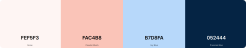

<!-- PROJECT LOGO -->

<h1 align="center">Road To Doisneau</h1>

 Take the road to see the past. 

<!-- TABLE OF CONTENTS -->

  
Table of Contents

  <ol>
    <li>
      <a href="#about-the-project">About The Project</a>
      <ul>
        <li><a href="#color-palette">Color Palette</a></li>
      </ul>
    <li><a href="#tech-stack">Tech Stack</a></li>
    <li><a href="#roadmap">Roadmap</a></li>
    <!-- <li><a href="#license">License</a></li> -->
    <li><a href="#contact">Contact</a></li>
    <li><a href="#acknowledgments">Acknowledgments</a></li>
  </ol>

<!-- ABOUT THE PROJECT -->
## About The Project

This is about the project...

Lorem ipsum dolor sit amet consectetur adipiscing elit. Quisque faucibus ex sapien vitae pellentesque sem placerat. In id cursus mi pretium tellus duis convallis. Tempus leo eu aenean sed diam urna tempor. Pulvinar vivamus fringilla lacus nec metus bibendum egestas. Iaculis massa nisl malesuada lacinia integer nunc posuere. Ut hendrerit semper vel class aptent taciti sociosqu. Ad litora torquent per conubia nostra inceptos himenaeos.

### Color Palette

(<a href="#readme-top">back to top</a>)

<!-- TECH STACK -->
## Tech Stack

List major frameworks/libraries used on the project.

* Language:
* Frontend:
* Backend:
* Database & Auth:
* Hosting:

(<a href="#readme-top">back to top</a>)

<!-- ROADMAP -->
## Roadmap

- [x] Add README.md
- [x] Add Promo Card
- [ ] Add API
- [ ] Add etc..

(<a href="#readme-top">back to top</a>)

<!-- LICENSE
## License

Distributed under the Unlicense License. See `LICENSE.txt` for more information.

(<a href="#readme-top">back to top</a>)
 -->

<!-- CONTACT -->
## Contact

Project Link:

* Samira - samira.shabanoska.25@stud.itsaltoadriatico.it
* Franco - francesco.tomasella.25@stud.itsaltoadriatico.it
* Fabio - fabio.catanzaro.25@stud.itsaltoadriatico.it
* Jacopo - jacopo.bergamasco.25@stud.itsaltoadriatico.it

(<a href="#readme-top">back to top</a>)

<!-- ACKNOWLEDGMENTS -->
## Acknowledgments

List resources you find helpful and would like to give credit to.

* [MD Basic Syntax](https://www.markdownguide.org/basic-syntax/#reference-style-links)
* [README Template](https://github.com/othneildrew/Best-README-Template/tree/main)

(<a href="#readme-top">back to top</a>)

